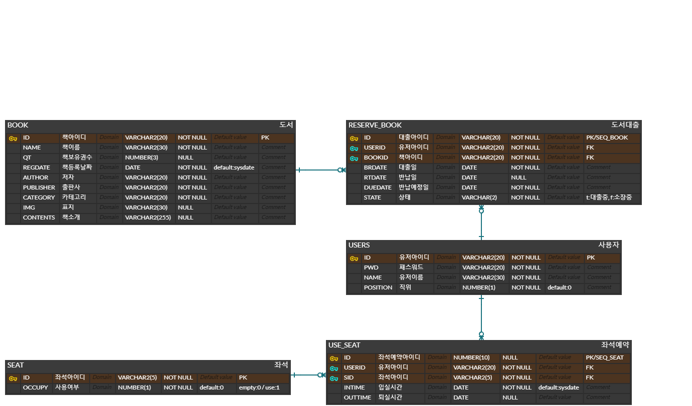
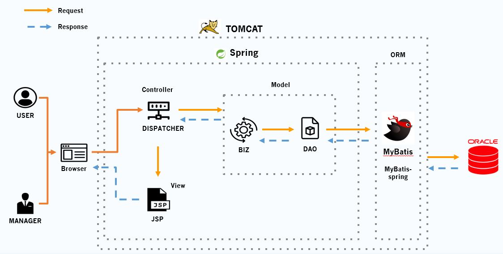

# DDOK LIBRARY(대학교 스마트 도서관 시스템)

## 주제

> 대학 도서관을 외부에서 간단하게 사용할 수 있는 시스템. 
>
> 도서 검색 및 대여, 열람실 배정 등 온라인으로 이용 가능하여 도서관 이용자들에게 편리함을 준다. 
>
> 하나의 시스템으로 도서관을 관리할 수 있어 사서의 업무의 효율을 높일 수 있다.

 ## 내용

*  메인 페이지에서 로그인 정보, 소장 도서 검색, 도서관 이용방법을 확인할 수 있다. 
* 로그인 후, 도서 대여 및 내역 조회, 좌석 예약이 가능하다. 
* 관리자는 교직원, 학생, 외부인으로 나뉘어 회원을 관리할 수 있다.
* 분류(학생/교직원/외부인/관리자)에 따라 도서 대여 가능 권수가 다르며, 학생의 경우에만 열람실 좌석 예약이 가능하다.
* 관리자의 경우 관리자용 페이지를 통해 신간 도서 등록, 도서 대출 내역 조회 등을 확인할 수 있다.
* 로그인 시 대여중인 도서의 반납일을 알려준다. 
* 연체 중일 경우 해당 사용자는 대여가 불가능하며, 도서 반납과 연체료를 납부한 후에 대여가 가능하다.
* 열람실 좌석은 배정 후 바로 사용할 수 있고 현재 사용중인 좌석은 배정이 불가능하다. 
* 퇴실 처리를 한 후에 퇴실 가능하다

## ERD

## 시스템 구성도

